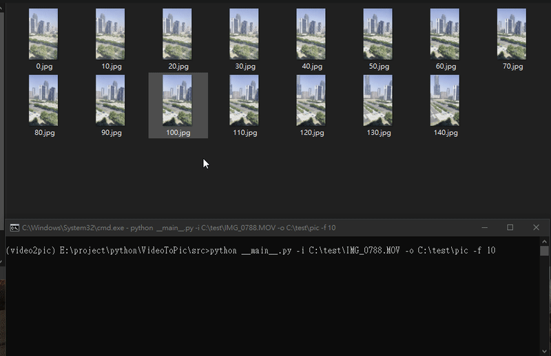

# Overview
It is a tool that can convert video to image

# Prerequisites:
- Python

# Installation

```bash
pip install -r requirements.txt
```

# Usage

```bash
python __main__.py -i {input_file} -o {output_path} -f {frame}
```

# Demo
[